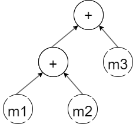

## 1.如何实现最简单的矩阵计算
以最简单的矩阵加法为例，  
```
mat1=mat1+mat2+mat3
```
我们可以这样实现一个简单的固定大小的矩阵类进行加法运算：
```
template <int M, int N>
class Matrix {
  float m_data[M * N];

 public:
  const float &coeff(int i, int j) const { return m_data[i + j * M]; }
  float &coeff(int i, int j) { return m_data[i + j * M]; }
};

template <int M, int N>
Matrix<M, N> operator+(const Matrix<M, N> &A, const Matrix<M, N> &B) {
  Matrix<M, N> res;
  for (int j = 0; j < N; ++j)
    for (int i = 0; i < M; ++i)
      res.coeff(i, j) = A.coeff(i, j) + B.coeff(i, j);
  return res;
}
```
分析以上代码的执行过程，首先会将mat1、mat2相加产生临时变量temp1，temp1会继续与mat3相加得到temp2，
最后temp2会被赋值给mat3。在这个过程中，程序会进行3次For循环，产生2个临时变量，8*M*N次内存访问，
这种方式显然十分低效，理想的计算过程应该是：
```
  for (int j = 0; j < N; ++j)
    for (int i = 0; i < M; ++i)
      mat1.coeff(i, j) = mat1.coeff(i, j) + mat2.coeff(i, j) + mat3.coeff(i,j);
```
这种写法虽然简单又高效，但是需要显式的写出For循环暴露计算细节，破坏了矩阵对象的封装性，
如何以比较紧凑的运算符写法来实现加法运算的同时保持计算高效呢？

这里引入Eigen的第一个核心机制：表达式模板（Expression Template），表达式模板是一种模板元编程技术，根据表达式的运算顺序，
将操作符和操作数通过模板类记录下来形成树状结构，`mat1+mat2+mat3`可以表示为：
<div align='center'></div>
<p>这种树状结构的优点之一在于保存了表达式计算的所有信息，可以独立地维持表达式的状态而无需立即绑定到某个变量进行计算，这种特性称为惰性计算（Lazy evaluation），是指仅产生值需求时才对表达式进行求值，与传统的立即求值（Eager Evaluation）相比，惰性求值可以借助上下文信息避免很多无用计算，从而带来性能提升。</p>     
那么如何通过模板实现这一数据结构呢，可以通过实现一个MatrixSum类表示矩阵加法，重载"+"运算符进行模板的嵌套

```
template <typename ExprA, typename ExprB>
class MatrixSum {
  const ExprA &lhs;
  const ExprB &rhs;

 public:
  MatrixSum(const ExprA &lhs, const ExprB &rhs) : lhs(lhs), rhs(rhs) {}

  float coeff(int i, int j) const { return lhs.coeff(i, j) + rhs.coeff(i, j); }
};

template <int M, int N>
MatrixSum<Matrix<M, N>, Matrix<M, N>> operator+(const Matrix<M, N> &lhs,
                                                const Matrix<M, N> &rhs) {
  return MatrixSum<Matrix<M, N>, Matrix<M, N>>(lhs, rhs);
}

template <int M, int N, typename Expr>
MatrixSum<Matrix<M, N>, Expr> operator+(const Matrix<M, N> &lhs,
                                        const Expr &rhs) {
  return MatrixSum<Matrix<M, N>, Expr>(lhs, rhs);
}

template <int M, int N, typename Expr>
MatrixSum<Expr, Matrix<M, N>> operator+(const Expr &lhs,
                                        const Matrix<M, N> &rhs) {
  return MatrixSum<Expr, Matrix<M, N>>(lhs, rhs);
}
```

此时 `mat1+mat2+mat3` 最终形成的数据结构为 <code> MatrixSum<MatrixSum<Matrix,Matrix>, Matrix> </code>，这个结构与上文提到的表达式树对应，记录了两层嵌套的加法运算，且在构造的过程中不进行任何计算，真正的计算是在调用MatrixSum中的coeff函数时才会执行，此时会递归调用加法两个运算数表达式的coeff函数，直到调用到Matrix类中的coeff函数获取到实际值，函数调用再不断出栈完成运算，在这个过程中，表达式的运算顺序是隐式的由函数调用栈决定的。如果我们将coeff函数优化为内联，则函数调用栈帧的开销可以省去，此时`(mat1+mat2+mat3).coeff(i,j)`可以展开为`mat1.coeff(i, j) + mat2.coeff(i, j) + mat3.coeff(i,j)`，此时对Matrix类重载opetator=即可完成上文提到的最理想的矩阵计算。

```
  template <typename Expr>
  Matrix& operator=(const Expr &expr) {
    for (int j = 0; j < N; ++j)
      for (int i = 0; i < M; ++i) 
      coeff(i, j) = expr.coeff(i, j);
    return *this;
  }
```

上述这种约定同名coeff函数进行递归调用来完成表达式值运算的方法被Eigen称为bottom-up方法，即自下而上的执行运算，这种方式足够简单省事，但正是这种简单会限制运算的灵活性，coeff函数只能根据运算类型实现运算逻辑，但不能根据表达式类型来调整运算状态，感觉有点拗口，举一个简单的例子，针对`mat1+mat2+mat3`的表达式模板，我们突发奇想希望将运算逻辑变为先保存前两个运算数`mat1+mat2`的运算结果为中间变量，再将中间变量与最后一个运算数相加，但是分析表达式模板的运算过程即可知，由于计算本身是由函数调用栈隐式控制的，这个过程不保留任何中间计算结果。如何做到这一点呢，可能需要对MatrixSum<Matrix,Matrx>类型做特化，在对MatrixSum的构造过程中，就执行表达式的运算并将运算结果作为成员变量保留，这样可以间接达到保留中间变量的特性。

```
template <int M, int N>
class MatrixSum<Matrix<M, N>, Matrix<M, N>> {
  Matrix<M, N> temp;

 public:
  MatrixSum(Matrix<M, N> &lhs, Matrix<M, N> &rhs) {
    for (int j = 0; j < N; ++j) {
      for (int i = 0; i < M; ++i) {
        temp.coeff(i, j) = lhs.coeff(i, j) + rhs.coeff(i, j);
      }
    }
  }

  float coeff(int i, int j) { return temp.coeff(i, j); }
};
```

Eigen采用了类似的机制根据表达式的状态来影响计算，这里引入Eigen的第二个核心机制：Evaluator。在Eigen中，对构建的表达式树进行值运算时，采用的是Top-down方法，即自上而下的，针对每一级表达式都会创建一个Evaluator，Evaluator实际上是参与运算的表达式的代理类，在coeff函数的调用过程中，不直接调用子表达式的coeff，而是临时创建子表达式的Evaluator，对Evaluator中的coeff进行调用，这样做的最大好处在于，我们可以充分利用c++模板偏特化的特性，对不同的表达式，根据实际需求自由的对各个Evaluator特化实现。针对上述例子，不同于我们直接对`MatrixSum<Matrix,Matrx>`进行特化，Eigen是对`Evaluator<MatrixSum<Matrix,Matrx>>`进行特化，这样不影响表达式自身的数据结构，从而在表达式模板的构建过程中也不产生中间计算，将中间结果的运算也延迟到了实际产生值需求时。

```
template <typename Expr>
class Evaluator;

template <typename ExprA, typename ExprB>
class Evaluator<MatrixSum<ExprA, ExprB>> {
  Evaluator<ExprA> evalA(A);
  Evaluator<ExprB> evalB(B);

  float coeff(int i, int j) const {
    return evalA.coeff(i, j) + evalB.coeff(i, j);
  }
};

template <int M, int N>
class Evaluator<Matrix<M, N>> {
  const Matrix<M, N> &mat;
  float coeff(int i, int j) const { return mat.coeff(i, j); }
};

template <typename ExprA, typename ExprB>
class MatrixSum {
  const ExprA &lhs;
  const ExprB &rhs;
  ...
 // 临时创建Evaluator
  float coeff(int i, int j) const {
    return Evaluator<ExprA, ExprB>(lhs, rhs).coeff(i, j);
  }
};
```

<p>显然，这种创建Evaluator的方式和大量的偏特化在表达式计算时赋予了开发者更大的灵活性，另一方面也不可避免地带来了运算时创建Evaluator的性能开销，尽管Evaluator本身是个轻量化，不实际持有数据的代理对象，这点性能影响微乎其微。但假设Matrix矩阵较大，在赋值时重复调用coeff函数时反复创建Evaluator再不断销毁，同样会产生一定的性能影响。我们不禁反思，使用Evaluator这种Top-down方法的优点之处究竟在哪呢？至少上文提到的`mat1+mat2+mat3`例子只是我们的突发奇想罢了，实际不存在这样的需求。这里要引出Coeff-Wise Operation（元素对元素运算）的概念，在Coeff-Wise的运算中，运算的依赖域仅局限在不同矩阵的单元素之间，单次表达式求值对应一次基本元素运算，Coeff-Wise运算组合构成的表达式树可以线性展开成多个基本元素之间的运算，此时两种方法的差别不大。但是对于非Coeff-Wise运算，最经典的为矩阵乘法，每个表达式的结果元素对应N次基本元素乘法，则构成的表达式树运算数是非线性叠加的，例如`mat1*mat2+mat1*mat2`，假设mat1和mat2分别为m*n和n*p阶矩阵，若不保存中间变量采用bottom-up的方法，则总的运算数为mnp*mnp，显然这种运算消耗是不可接受的，此时采用Top-down的方法即可以通过特化`Evaluator<MatrixProduct<Matrix,Matrx>>`，在Evaluator中保留中间变量来避免这种局限性。</p>

<p>而对于上文提到的矩阵赋值时循环调用coeff重复创建Evaluator的问题，这个也很好解决，我们可以将赋值运算符=再包一层，创建一个Assign对象，再同样通过Evaluator进行赋值，类似

```
template <typename Dest, typename Source>
class Evaluator<Assign<Dest, Source>> {
  Evaluator<Dest> evalDst(dest);
  Evaluator<Source> evalSrc(source);
  ...
  void run() {
    for (int i = 0; i < evalDst.size(); ++i)
      evalDst.coeff(i) = evalSrc.coeff(i);
  }
};
```


