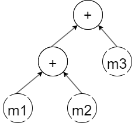

## 1.如何实现最简单的矩阵计算
以最简单的矩阵加法为例，  
```
    mat1=mat1+mat2+mat3
```
我们可以这样实现一个简单的固定大小的矩阵类进行加法运算：
```
template <int M, int N> 
class Matrix {
  float m_data[M * N];
  float &operator()(int i, int j) { return m_data[i + j * M]; }
};

template <int M, int N>
Matrix<M, N> operator+(const Matrix<M, N> &A, const Matrix<M, N> &B) {
  Matrix<M, N> res;
  for (int j = 0; j < N; ++j)
    for (int i = 0; i < M; ++i)
      res(i, j) = A(i, j) + B(i, j);
  return res;
}
```
分析以上代码的执行过程，首先会将mat1、mat2相加产生临时变量temp1，temp1会继续与mat3相加得到temp2，
最后temp2会被赋值给mat3。在这个过程中，程序会进行3次For循环，产生2个临时变量，8*M*N次内存访问，
这种方式显然十分低效，理想的计算过程应该是：
```
  for (int j = 0; j < N; ++j)
    for (int i = 0; i < M; ++i)
      mat1(i, j) = mat1(i, j) + mat2(i, j) + mat3(i,j);
```
这种写法虽然简单又高效，但是需要显式的写出For循环暴露计算细节，破坏了矩阵对象的封装性，
如何以比较紧凑的运算符写法来实现加法运算的同时保持计算高效呢？

这里引入Eigen的第一个核心机制：表达式模板（Expression Template），表达式模板是一种模板元编程技术，根据表达式的运算顺序，
将操作符和操作数通过模板类记录下来形成树状结构，`mat1+mat2+mat3`可以表示为：
<div align='center'></div>
<p>这种树状结构的优点之一在于保存了表达式计算的所有信息，可以独立地维持表达式的状态而无需立即绑定到某个变量，这种特性称为惰性计算（Lazy evaluation），是指仅产生值需求时才对表达式进行求值，与传统的立即求值（Eager Evaluation）相比，惰性求值可以借助上下文信息避免很多无用计算，从而带来性能提升。</p>     
那么如何通过模板实现这一数据结构呢，可以通过实现一个MatrixSum类表示矩阵加法，重载运算符进行模板的嵌套

```

template <typename ExprA, typename ExprB> class MatrixSum {
  const ExprA &lhs;
  const ExprB &rhs;

public:
  MatrixSum(const ExprA &lhs, const ExprB &rhs) : lhs(lhs), rhs(rhs) {}

  float coeff(int i, int j) { return lhs.coeff(i, j) + rhs.coeff(i, j); }

  template <typename ExprC>
  MatrixSum<MatrixSum<ExprA, ExprB>, ExprC> operator+(const ExprC &rhs) {
    return MatrixSum<MatrixSum<ExprA, ExprB>, ExprC>(*this, rhs);
  }
};

template <int M, int N> class Matrix {
  float m_data[M * N];

public:
  float &coeff(int i, int j) { return m_data[i + j * M]; }
  MatrixSum<Matrix, Matrix> operator+(const Matrix &rhs) {
    return MatrixSum<Matrix, Matrix>(*this, rhs);
  }
};

```
最终形成的数据结构为<code>MatrixSum<MatrixSum<Matrix,Matrix>, Matrix></code>
    

